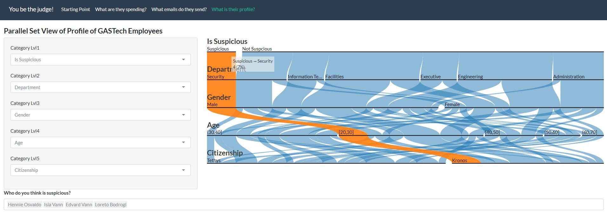
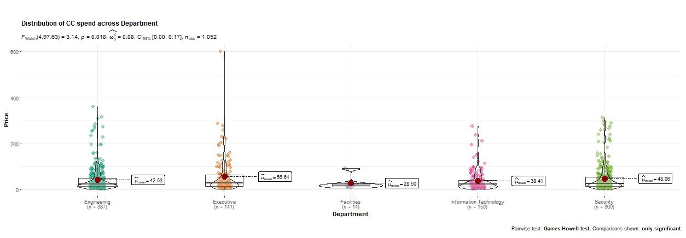
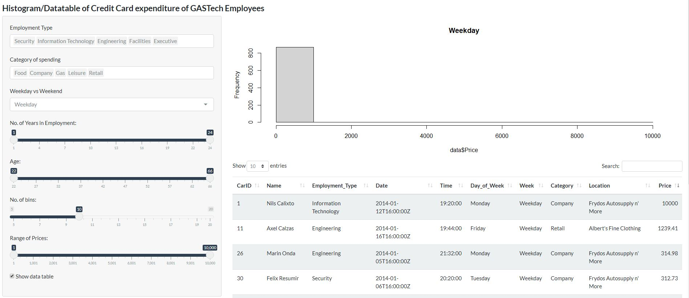
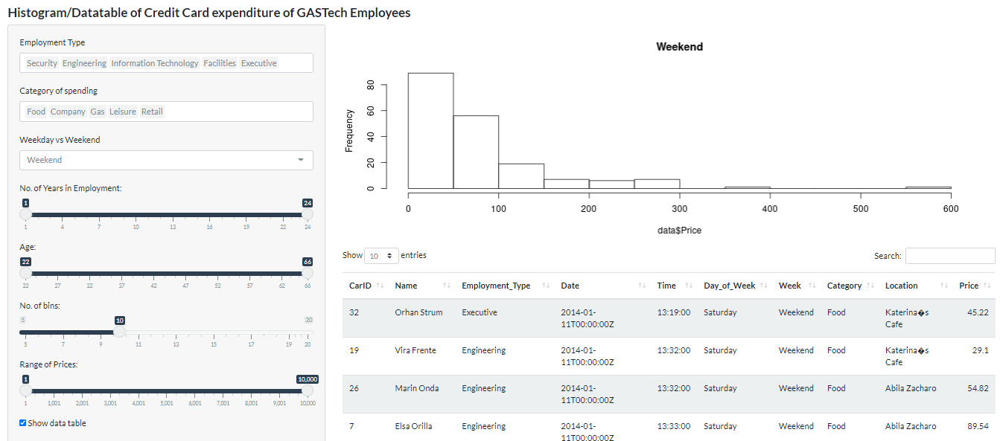
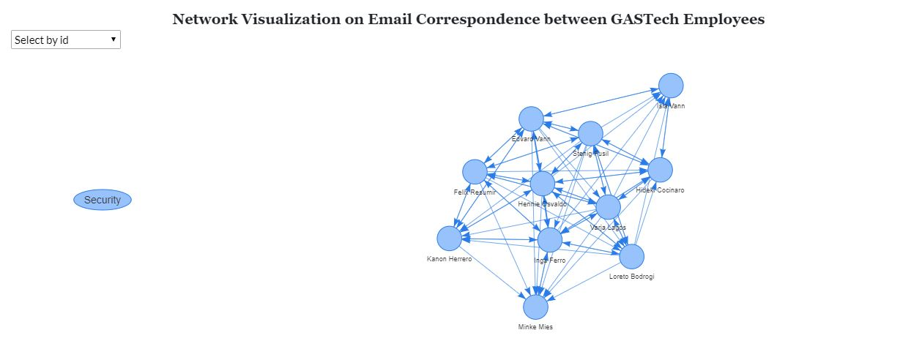
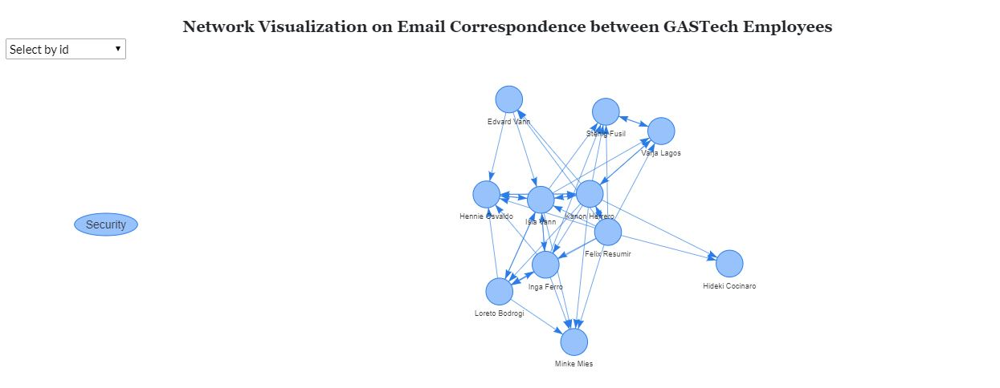
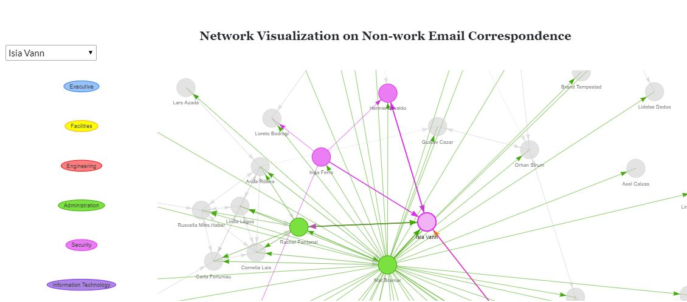
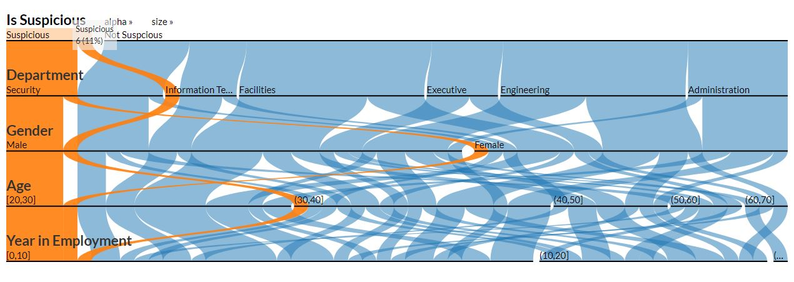

```{r setup, include=FALSE}
knitr::opts_chunk$set(echo = FALSE)
```

# Introduction

In January 2014, the leaders of GAStech are celebrating their new-found fortune as a result of the initial public offering of their very successful company. In the midst of this celebration, several employees of GAStech go missing. An organization known as the Protectors of Kronos (POK) is suspected in the disappearance, but things may not be what they seem. It appears that certain employees of GAStech may be involved in the disappearance. 

# Motivation

This project is motivated by findings that there were suspicious activities within GAStech itself which were worth investigating. This project aims to create a data analytics applications to visualize these suspicious activities and relationships for users to judge, who exactly are the suspicious people in GASTech. We do this by exploring the following:

* Conducting exploration data analysis and inferential data analysis on existing data sets (e.g. credit card transactions, email communications).
    
* Delivering a R-Shiny app that achieve the following through an interactive user interface design: 
    + Identifying any anomalous or suspicious behavior.
    + Identifying formal and informal relationships
    + Discover any associations based on common interest given in the data.  
    + Obtaining a holistic profile on these suspicious employees. (Who is suspicious?)

# Approach

We will:
* Conduct data preparation using dplyr and other R packages.
* Analyse VAST 21 data set with background research using:
    + Exploratory Data Analysis (EDA) methods in R.
    + Inferential Analysis methods in R.
    + Network Analysis in R.
* Creating a R shiny dashboard showing our findings/insights and conclusions:
    + R Markdown development for functionality checks
    + R-Shiny app development for user interactivity

# Results

## First Look

We identify four GAStech employees have familial relationships with members of POK and hence are the most suspicious people in GAStech:

* Hennie Osvaldo 
* Isia Vann 
* Edvard Vann 
* Loreto Bodrogi

Using the ParSet view to see their profile: 



These four people are observed to have many similarities. They are all males in their twenties and all from the security department, probably with a lot of drive and impulse to possibly plot an internal kidnapping. In our subsequent analysis, we scrutinize closely the data with these characteristics. 

## Credit Card Expenditure

Looking at credit card transactions, we add all options so that the data is not filtered and we sort the data table by price. We can immediately see that there are a few outliers. Looking at statistical analysis on the `inferential` tab allows us to confirm that the outliers are worth investigating.



Excluding the outliers, the analysis tells us that there is insufficient statistical evidence to reject the null hypothesis that mean of the transactions between the departments are the same. In fact, the means of the transactions hover between $25-60 which suggests the outliers that we spotted is worth investigating into.

Histogram for Weekday: 



Histogram for Weekend: 



We make the following observations: 
* Nils Calixto 
  + Made a purchase of $10,000 at Frydos Autosupply n' More just two days before the kidnapping.
  + Other transactions are charged to the decimal place, but this particular transaction is very neat at $10,000. 
  + if we compare to the other purchases within the same cateogory, most transactions fall below $500. 
  + This single transaction make Nils Calixto very suspicious. 
* Axel Calzas 
  + Made a purchase of $1239.41 at Albert's Fine Clothing just 3 days before the kidnapping. 
  + Most purchases made are around $300. It could be that Axel helped pick up for 3-4 person. 
  + We consider Axel Calzas as suspicious first but we should look into his relationships in more detail. 
* Sten Sanjorge Jr 
  + Made a purchase of $600 at the Chostus Hotel just 3 nights before the kidnapping incident. 
  + Sanjorge Jr was initially counted as one of the kidnapped victims but it turns out that he was just returning to Tethys. (add ref)
  + The combination of this news and this transaction makes the CEO a suspect as well. 
  
## Email Correspondence 

We focused straight into the correspondence within the security team and compare the differences between Work and Non Work below: 

Network Visualization for Security Department - Work Correspondence: 



Network Visualization for Security Department - Non-Work Correspondence: 



If we observe the network of Work Correspondence, we observe that the emails sent are sent rather consistently throughout the team, however if we look at the other visualization we can see quite obviously the imbalance. Isia Vann and Hennie Osvaldo seems to be in the center of all these correspondence. There are some members who only receive emails while for some members, where there are exchange of emails. 

Let us scrutinize the non work email correspondence of Isia Vann with the rest of the organization: 



We find another member closely related to our current suspicious candidates - Inga Ferro who is in correspondance with at least 3 of the original suspicious candidates which makes this person suspicious as well. 

When we select Axel Calzas, we realize that this person do not have non-work correspondence, and any work related emails are department of company based. This eliminates the suspicious off and we removed the name. 

## Parset Final 

Here is the final profile of our judgement of suspicious employees in GASTech: 




# Future Work

The application was developed using the Shiny architecture on R, supported with a range of statistical packages to provide users with a whole range of techniques to derive insights from the data. Definitely though, the range of techniques and ideas executed in this project is non-exhaustive and We suggest that the below can be explored in the future development of the app:

* Additional user interaction features within and between each tab in the app to speed up the detection of suspicious individuals. E.g. users could be given the option to highlight certain transactions in the violin plot and that simultaneously triggers the network visualisation tab to showcase any connections between the individual who made that transaction.

* The GPS dataset can be utilised further. An additional tab exploring the daily commutes of the employees could be used to further illustrate the daily routiness and the relationships between the employees.


# Try out the App yourself! 

You can access the app [here](https://whoissuspicious.shinyapps.io/who_is_suspicious/).

# References

*Cherie Wong, D. D. (2020). A Visual Exploration of Media Consumption in Singapore. 
*Hendricksen, J. (2013). Profiler: Deriving a digital profile from open source information. 
*Tushar Sonawanev, S. S. (2015). Crime Pattern Analysis, Visualization And Prediction Using Data Mining . 
*Wheeler, A. P. (2017). Crime Data Visualization for the Future. 

